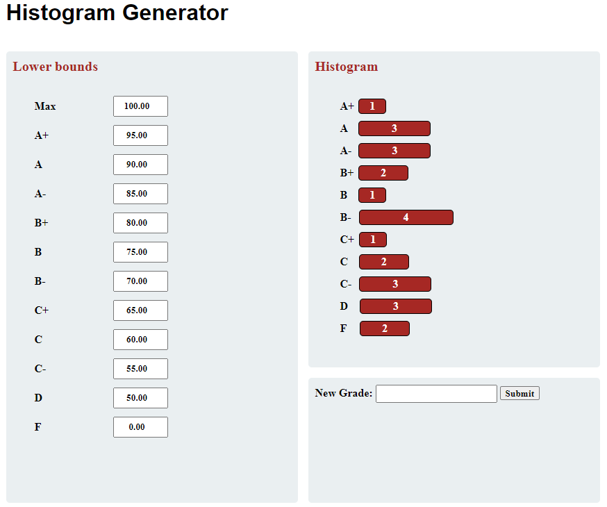

# Histogram-Visualizer
Simple HTML, CSS, JS Grade visualizer for a list of student grades

## Details
- create an interactable grading scale that shows how many students fall into each grade range
- recreate a given template through HTML & CSS
- add functionality with JavaScript

## Recreated Version

